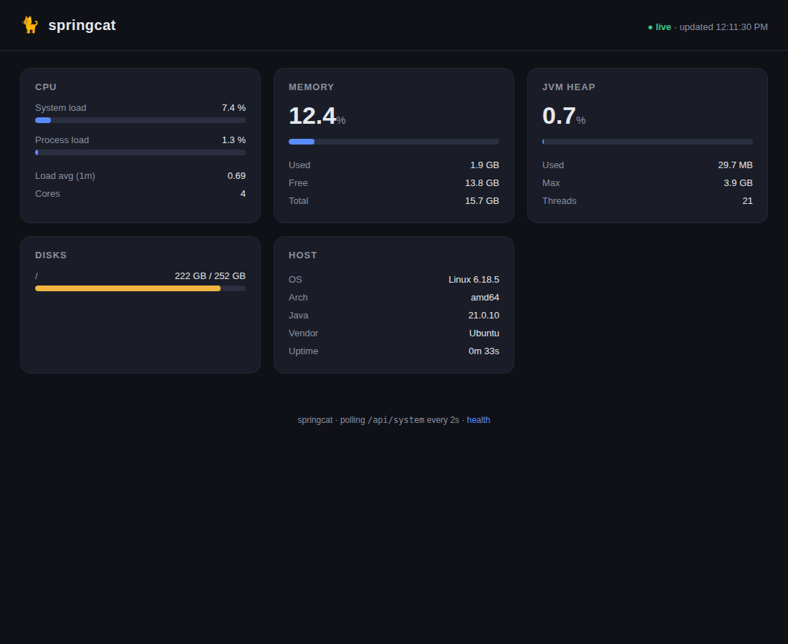

# springcat 🐈

A lightweight **system-monitoring** web app built on Spring Boot (Spring + Tomcat).
It exposes live host and JVM metrics as JSON and serves a self-contained,
auto-refreshing dashboard.



## Features

- **Live dashboard** at `/` — CPU, physical memory, JVM heap, disks, and host info,
  polled every 2 seconds. Usage bars turn amber above 70% and red above 90%.
- **JSON API** at `GET /api/system` — a single point-in-time snapshot.
- **Actuator** endpoints (`/actuator/health`, `/actuator/info`, `/actuator/metrics`).
- **No native dependencies** — metrics come from the JDK management beans
  (`java.lang.management` and `com.sun.management`), degrading gracefully to
  `n/a` where a value is unavailable.

## Requirements

- Java 21+
- Maven 3.9+ (or use the system `mvn`)

## Run

```bash
mvn spring-boot:run
```

Then open <http://localhost:8080>. Change the port with `--server.port=9090`.

## Build a runnable jar

```bash
mvn clean package
java -jar target/springcat-0.1.0.jar
```

## Test

```bash
mvn test
```

## API

`GET /api/system` returns:

```json
{
  "timestamp": 1784031059960,
  "host":   { "osName": "Linux", "osVersion": "6.18.5", "arch": "amd64",
              "availableProcessors": 4, "javaVersion": "21.0.10",
              "javaVendor": "Ubuntu", "uptimeMillis": 3273 },
  "cpu":    { "systemLoad": 0.35, "processLoad": 0.32, "loadAverage1m": 0.77 },
  "memory": { "totalBytes": 16856244224, "usedBytes": 1458855936,
              "freeBytes": 15397388288, "usedFraction": 0.086 },
  "jvm":    { "heapUsedBytes": 24847696, "heapMaxBytes": 4215275520,
              "heapUsedFraction": 0.0058, "threadCount": 21 },
  "disks":  [ { "path": "/", "totalBytes": 270553174016, "usedBytes": 238405967872,
                "freeBytes": 32147206144, "usedFraction": 0.88 } ]
}
```

Load fractions are in the range `[0, 1]`; a value of `-1` means the metric is not
available on the current JVM/OS.

## Layout

```
src/main/java/com/springcat/
  SpringcatApplication.java        Spring Boot entry point
  controller/SystemController.java REST API (/api/system)
  service/SystemMonitorService.java Metric collection via JDK management beans
  model/SystemSnapshot.java        Immutable snapshot records
src/main/resources/
  application.properties
  static/index.html                Dashboard (no external assets)
```
