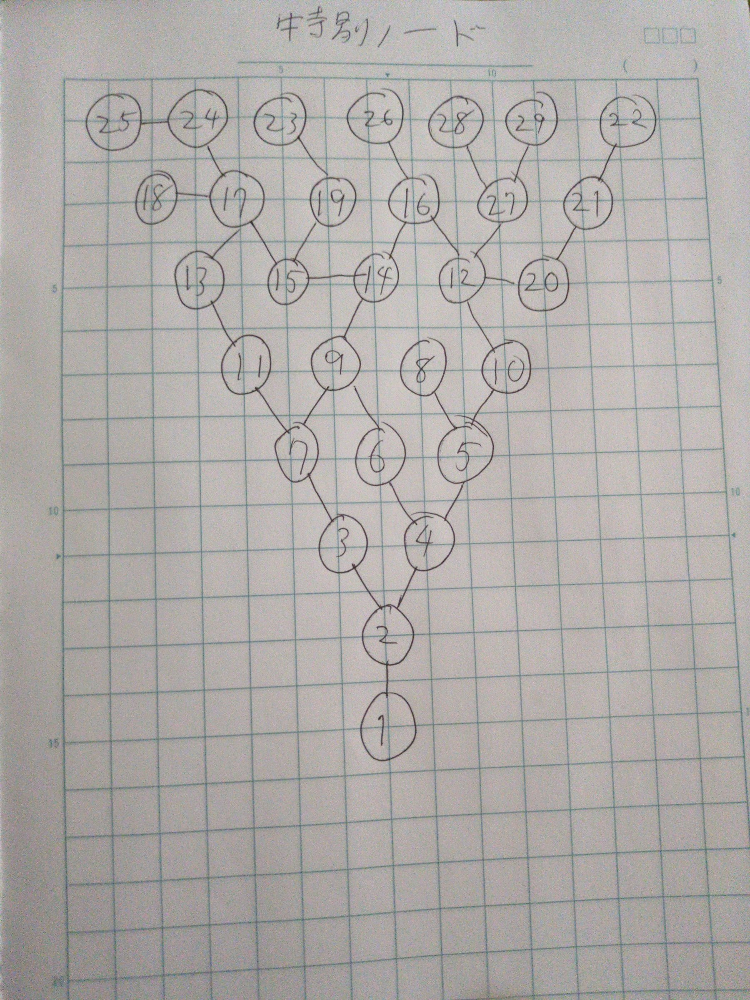

# 🎁 特別ノード ツリー (Special Node Tree) — 設計メモ

> 課金「追加要素パック」(¥5,700) で解禁される **特別ノード** の設計図。
> 作者(springcat)の手描き構想を記録したもの。**効果は開発中。**
>
> 正本 = `special-node-tree.jpg`（この図が最終的な正）。以下の文字起こしは
> 補助であり、枝(接続)に読み取り不確実な箇所があるため、実装前に作者の確認が必要。

## 確実に言えること
- ノードは **1〜29 の番号付き**（手描きで全 29 ノード前後）。
- **ノード1 が入口（根）**。図の右端にあり、そこから左へツリー状に広がる。
  - コード上の解禁フラグは `_specialNodeUnlocked`（`localStorage: blockdestory_specialNodeUnlocked`）。
    パック購入 (`pack_starskip`) でこのフラグが立つ。
- ノード1 → ノード2 の一本道で始まり、**ノード2 が最初の分岐点**（上枝・下枝へ二又）。
- そこから左へ行くほど枝分かれし、左端が末端ノード
  （読み取れる範囲で 22 / 25 / 29 / 23 / 24 / 18 / 28 / 26 などが葉）。
- 上部に 22–21–20 の一本鎖があり、20 が中央の 12 付近へ合流する。

## 文字起こし（DRAFT・要確認）
> ⚠️ 下の隣接リストは写真からの推定で、特に中央〜左の枝は不確実。
> 実装時は画像を見て確定させること。作者に「この接続で合ってる?」と確認する。

- 1 — 2
- 2 — 3, 2 — 4
- 4 — 5, 4 — 6（4 まわりは 5/6/9 が近接して不確実）
- 5 — 8, 5 — 10
- 3 — (下枝へ: 7? / 5下? 不確実)
- … 中央の 6/9/8/11/14/15/16/12/17 付近の枝は写真から確定できず未記入 …
- 上鎖: 22 — 21 — 20 — 12
- 12 — 17, 12 — 16, 12 —(10方向)
- 17 — 29, 17 — 28
- 16 — 14, 16 — 26(?)
- 14 — 15, 15 — 19, 15 — 13, 13 — 11
- 19 — 23, (17下) — 24 — 25, 24 — 18

## TODO（実装時）
1. 画像を見て **正確な隣接リスト**を確定（上の DRAFT を作者と一緒に修正）。
2. 各ノードの **効果** を定義（開発中）。指数系/倍率系/生成系など。
3. ノードの **解禁順・コスト・通貨** を決める（1 が起点。親を買うと子が解禁など）。
4. `_specialNodeUnlocked` を前提に、`getFinalDigitScore` 等へ効果を適用。
   購入状態は per-node で保存（例: `blockdestory_specialNodePurchased = {1:true,...}`）
   し、`_extraKeys` に追加して引き継ぎ対応する。
